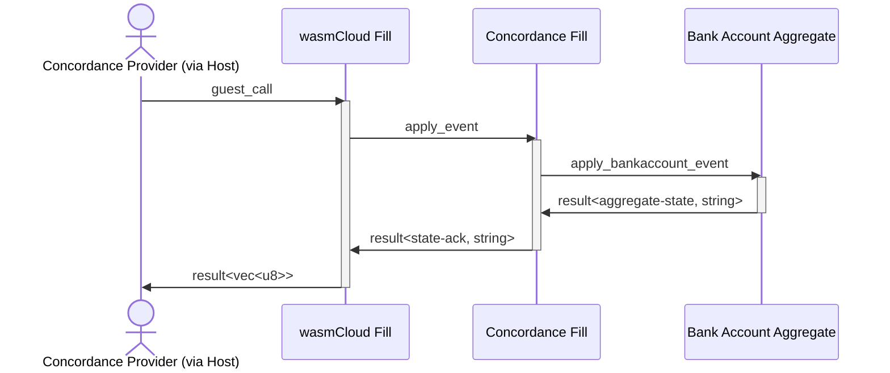

# Component Demo - Kubecon 2023 (Event Sourcing with WebAssembly)
This isn't the entire demo for the conference, this contains just the code needed for the portion
of the demo where an 'off the shelf' bank account aggregate is fused to work with wasmCloud and Concordance
with no modification.

The execution flow through the various fills happens according to the following sequence diagram:

So the call chain looks like this:

1. Host invokes exported `actor.guest_call` with an `operation` and `payload`
1. wasifill exporting `guest_call` invokes imported `apply_event` after converting payload to a `concordance.event`
    1. this converts the incoming `payload` into an `event-with-state`
1. bankaccount wasifill exporting `apply_event` takes input and calls imported `bankaccount-aggregate`'s `apply_account_created` function.   

Concordance does not care about the internal shape that the aggregate state takes, so the concordance fill for this demo can pick whatever serialization pattern it likes.

The end result of this demo should be that we can build a "fused" component by attaching a domain-specific wasifill (bankaccount) to a provider wasifill (concordance) and exporting `guest_call`